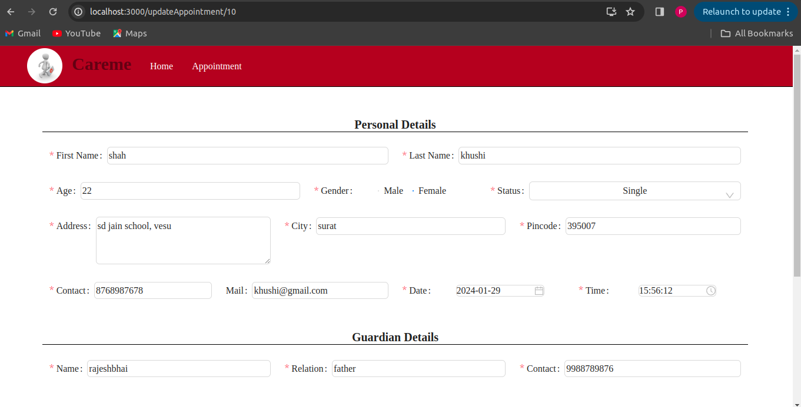
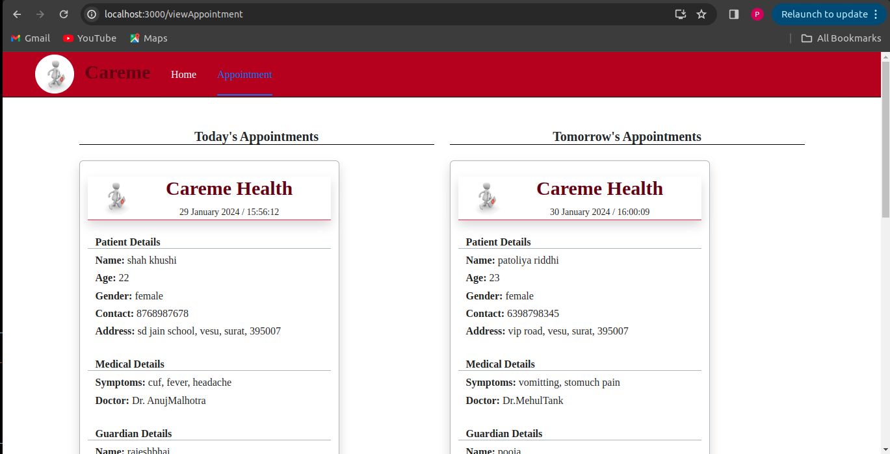

# ReactPaper_01
This is for react practical test 1 given on 22-Jan-2024

*** BACKEND DETAILS ***
--> CONNECTION NAME:   ReactPaper_1
--> DATABSE NAME:   HospitalReception_RP1

*** DEPENDENCIES ***
--> CLIENT
  npx create-react-app client
  npm start
  npm install react-router-dom
  npm install antd
  npm install redux
  npm install react-redux
  npm install react-thunk
  npm install react-thunk
  npm install @reduxjs/toolkit
  npm install axios
  npm install moment
--> SERVER
  npm init-y
  npm install mysql2 sequelize sequelize-cli nodemon cors
  npx sequelize init

# UI

